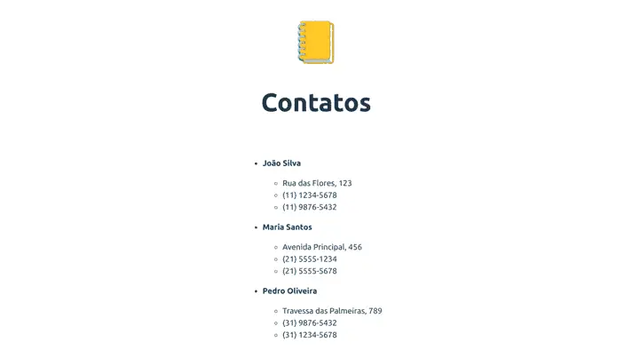

# Lista de contatos / Contact List

---

---

### 🇧🇷 pt-br

Demonstração de aplicação para aulas (Conceito da comunicação `FRONT` + `API` + `DB` (`Mock`, banco de dados falso)).

## Como rodar

Necessita do `NodeJS` instalado. Aqui foi usado a versão LTS `v18.18.2`.

[🌐 Baixe aqui!](https://nodejs.org/pt-br/download)

> A orientação considera o uso do [VSCode](https://code.visualstudio.com/download) execução do projeto, mas isso não é um requisito.

- Abra dois terminais, um para cada pasta da aplicação, e a partir da pasta raiz do projeto, acessar as pastas com os comandos `cd frontend` e `cd backend`;
- No front-end o comando utilizado para iniciar é o `npm i && npm run dev`;
- No back-end o comando utilizado para iniciar é o `npm i && npm run dev`.

Ao iniciar, você deve ter terminais com as seguintes informações:

> front-end iniciado

> back-end iniciado

Exemplo:

## Conceitos

- Comunicação entre a interface visual para o usuário final (`Front-end`) e a estrutura que funciona por de "trás dos panos" (`Back-end`);
- API (`Application Programming Interface`) - Interface de programação de aplicações;
- Abstração de dados e seu consumo através da internet (Protocolo `HTTP` e método `GET`) ou internamente (neste caso).

---

## 🇺🇸 en-us

Demonstration of app communication concept, for lectures (`FRONT` + `API` + `DB` (`Mock`, fake database)).

## How to run

Requires `NodeJS` installed. Here the LTS version `v18.18.2` was used.

[🌐 Download here!](https://nodejs.org/en/download)

> The guidance considers the use of [VSCode](https://code.visualstudio.com/download) running the project, but this is not a requirement.

- Open two terminals, one for each application folder, and from the project root folder, access the folders with the commands `cd frontend` and `cd backend`;
- In the front-end, the command used to start is `npm i && npm run dev`;
- In the back-end, the command used to start is `npm i && npm run dev`.

When starting, you should have terminals with the following information:

> front-end started

> backend started

Example:

## Concepts

- Communication between the visual interface for the end user (`Front-end`) and the structure that works "behind the scenes" (`Back-end`);
- API (`Application Programming Interface`) - Application programming interface;
- Data abstraction and consumption via the internet (`HTTP` protocol and `GET` method) or internally (in this case).
