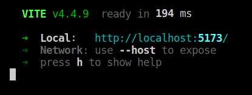
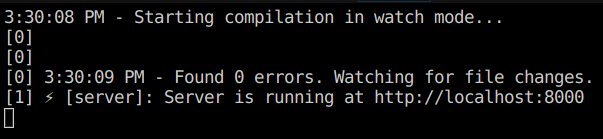

# Lista de contatos

Demonstração de aplicação para aulas (Conceito da comunicação `FRONT` + `API` + `DB` (`Mock`, banco de dados falso))

## Como rodar

Necessita do `NodeJS` instalado. Aqui foi usado a versão LTS `v18.17.1`. 

[🌐 Baixe aqui!](https://nodejs.org/pt-br/download)

- Abra dois terminais, um para cada pasta da aplicação (`frontend` e `backend`);
- No front-end o comando utilizado para iniciar é o `npm i && npm run dev`.
- No back-end o comando utilizado para iniciar é o `npm i && npm run dev`.

Ao iniciar, você deve ter terminais com as seguintes informações:

> front-end iniciado

> back-end iniciado